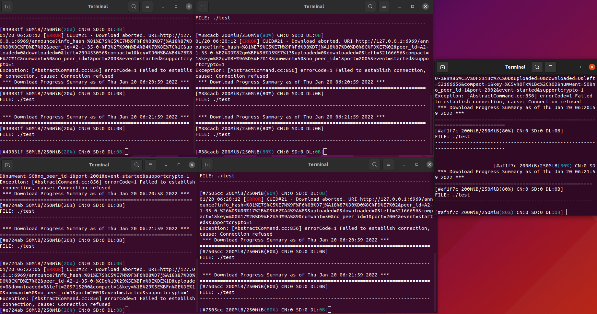
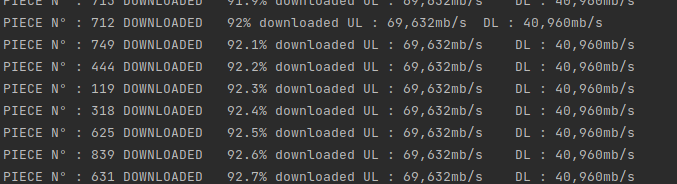
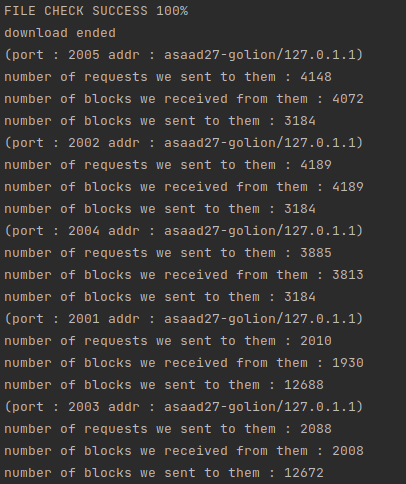
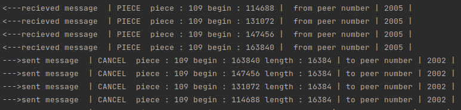

## Informations

[reports](/reports) folder contains profiler information about the execution and call trees...  
[documentation](/docs) folder contains java documentation;  
[log](/logs)  contains  examples of logs of some executed scenarios  
[example: log5multiclientsSeedAndLeechFast.txt](/logs/log5multiclientsSeedAndLeechFast.txt) : execution of scriptMultiClient.sh, starts with rarest first then switches strategies to random and endgame,at the beginning, peers have different % of files, at the end of the
download, all peers have all pieces, see for details about what file each peer has, example :   

**scenario:** 
test file : pieces ->  1_to 100  
peer1 : 1_to_200    port : 2001  
peer2 : 800_to_1000 port : 2003  
peer3 : 100_to_900  port : 2004  
peer4 : 400_to_669  port : 2005  
peer5 : 200_700     port : 2002  
 

**console output:** 

 

**end of the download console output stats**  

  

[log file](/logs/log5multiclientsSeedAndLeechFast.txt)  

## How to Use
either compile jar using : `mvn compile assembly:single`  
or use ready made equipe5-Final-jar-with-dependencies.jar

**command to execute:**

`java -jar equi*.jar torrentFileName.torrent [-s or -f] ` 
**-s** : used for secure downloading mode eq: limited number of requests to send and receive.  
**-f** : used for fast downloading mode  
detailed output is written to log.txt file in the jar directory.  

scripts are in [scriptsForTesting](/scriptsForTesting)  

**example of use:**  

inside [scriptsForTesting](/scriptsForTesting) folder, run  a script, for example `./scriptMultiClient.sh `
 , the script will create a file, generate it's torrent file from it and launch 5 aria2c instances, each with a specific range of pieces (can be used without opentracker to demonstrate strategies). The script will create
folders named peer_`from`_`to` with _from_ = first piece (1-index based) and _to_ = lastpiece **(max is 1000)**, with each folder is used by one Aria2c 
see the script file for more details and modifications.  
**IMPORTANT**: change announce URL to opentracker url in `-a http://..../announce` inside the script sh file.  
the script creates both torrent file, and metainfo file, hence the script can be used for multiple machines without the need of copying any file, and also for testing in one machine.  

see [scripts for generating files and torrents](/scripts) Readme for more details about how i created the scripts and infos about their CLI arguments

## file generator Linux and Windows
[scripts for generating files and torrents](/scripts)  

## opentracker for Windows

`docker build -t ot .`  
`docker run -p 6969:6969 ot`  
access opentracker in  http://localhost:6969/stats

## Bittorrent

execute MainBittorent with the torrent file as an argument  
edit generatePeerList() in TCPClient constructor with the ports
or use trackerList() to generate them from the tracker
